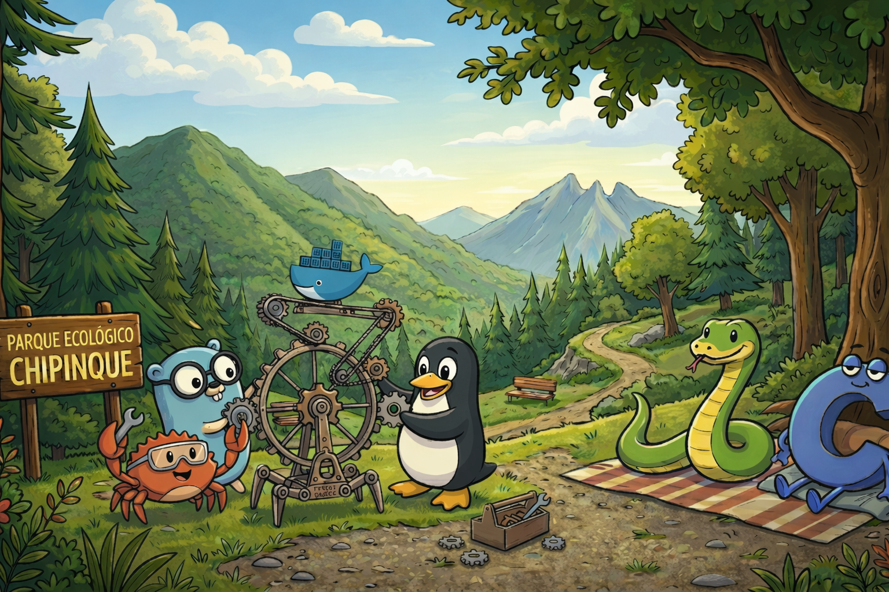

<p align="center">
  
</p>

# 🏗️ Builders MTY

**La mejor manera de aprender es ejecutando.**

Builders MTY es una comunidad abierta de estudiantes y desarrolladores en Monterrey enfocada en construir software real y compartir conocimiento. Iniciada por alumnos de la UANL (FCFM), somos un punto de encuentro para quienes disfrutan de destripar código y crear herramientas.

---

## 🛠️ El Stack

- **Framework:** [Next.js](https://nextjs.org/) (App Router)
- **Estilos:** [Tailwind CSS](https://tailwindcss.com/)
- **Backend/DB:** [Supabase](https://supabase.com/)
- **Infra:** [Railway](https://railway.app/) / [Vercel](https://vercel.com/)

## 🚀 Guía de Inicio

Si quieres colaborar o simplemente ver cómo funciona esto por debajo:

1. **Clona el repositorio:**
   ```bash
   git clone https://github.com/Raulgooo/BuildersMTY
   ```
2. **Instala dependencias:**
   ```bash
   pnpm install
   ```
3. **Inicia el entorno de desarrollo:**
   ```bash
   pnpm dev
   ```
4. **Visita:** `http://localhost:3000` (o el puerto que te asigne la terminal).

---

## 🤝 Conéctate

- **Discord:** [Únete a la comunidad](https://discord.gg/RPqWgsN5H6) para pedir feedback o colaborar.
- **Builders Network:** Nuestro directorio de talento basado en ejecución real.
- **Open Source:** Revisa nuestros repositorios activos y empieza a contribuir.

© 2026 Builders MTY. // Hecho con ☕️ y 💻 en Monterrey.
